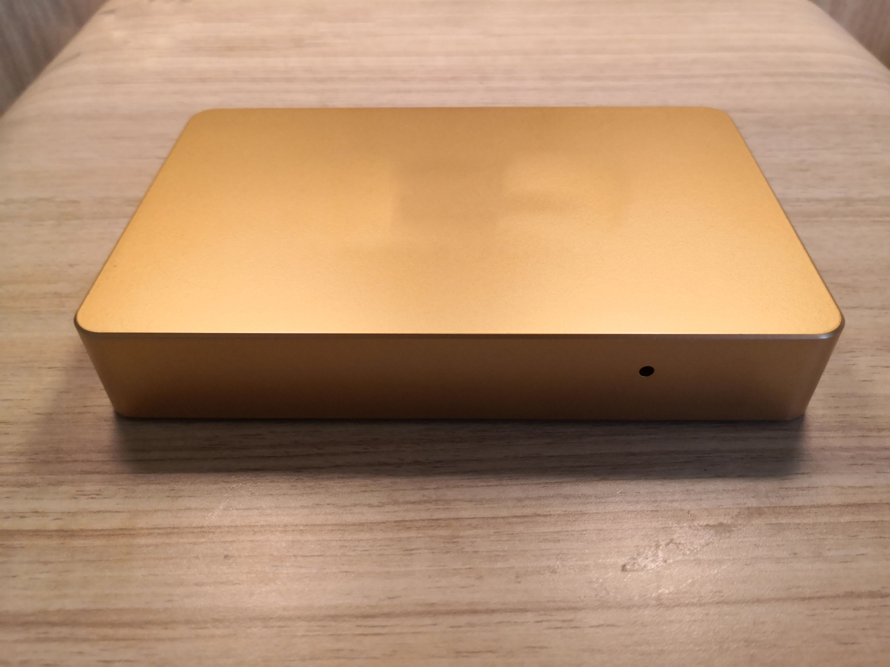

## About Me 👨🏻‍🎓

I am currently a second-year Ph.D student in [Media Analytics and Computing Lab (MAC)](https://mac.xmu.edu.cn/), Artificial Intelligence Department, School of Informatics, Xiamen University, China.
 
My supervisor is [Prof. Rongrong Ji](https://mac.xmu.edu.cn/rrji_en/).

## Research Interests

My research interests are in Computer Vison, Multimedia and Machine Learning.
 
Recently, I focus on:

- Weakly supervised object localization and detection
- Video analysis, including detection and classification

## Publications

- E2Net : Excitative-Expansile Learning for Weakly Supervised Object Localization.
   
  **Zhiwei Chen**, Liujuan Cao✉️, Yunhang Shen, Feihong Lian, Yongjian Wu, Rongrong Ji.
   
  ACM International Conference on Multimedia (ACM MM), 2021.
  [[PDF]()]

- Multi-scale Features for Weakly Supervised Lesion Detection of Cerebral Hemorrhage with Collaborative Learning.
   
  **Zhiwei Chen**, Rongrong Ji✉️, Jipeng Wu, Yunhang Shen.
   
  ACM International Conference on Multimedia Asia (ACM MM Asia), 2019.
  [[PDF](https://dl.acm.org/doi/10.1145/3338533.3372209)]

- Parallel Detection-and-Segmentation Learning for Weakly Supervised Instance Segmentation.
   
  Yunhang Shen, Liujuan Cao✉️, **Zhiwei Chen**, Baochang Zhang, Chi Su, Yongjian Wu, Feiyue Huang, Rongrong Ji.
   
  IEEE International Conference on Computer Vision (ICCV), 2021.
  [[PDF](https://openaccess.thecvf.com/content/WACV2021/papers/Hwang_Weakly_Supervised_Instance_Segmentation_by_Deep_Community_Learning_WACV_2021_paper.pdf)]

- Toward Joint Thing-and-Stuff Mining for Weakly Supervised Panoptic Segmentation.
   
  Yunhang Shen, Liujuan Cao✉️, **Zhiwei Chen**, Feihong Lian, Baochang Zhang, Chi Su, Yongjian Wu, Feiyue Huang, Rongrong Ji.
   
  IEEE/CVF Conference on Computer Vision and Pattern Recognition (CVPR), 2021.
  [[PDF](https://openaccess.thecvf.com/content/CVPR2021/papers/Shen_Toward_Joint_Thing-and-Stuff_Mining_for_Weakly_Supervised_Panoptic_Segmentation_CVPR_2021_paper.pdf)]

- Containing the Transmission of COVID-19: A Modeling Study in 160 Countries.
   
  Jia Rui, Yan Niu, Qiupeng Wang, Wei Zhang, **Zhiwei Chen**, Zeyu Zhao, Shengnan Lin, Yuanzhao Zhu, Yao Wang, Jingwen Xu, Xingchun Liu, Meng Yang, Wei Zheng, Kaixin Chen, Yilan Xia, Lijuan Xu, Rongrong Ji, Taisong Jin, Yong Chen, Benhua Zhao, Yanhua Su, Tie Song, Guoqing Hu✉️, Tianmu Chen✉️.
   
  Frontiers in medicine, 2021.
  [[PDF](https://www.ncbi.nlm.nih.gov/pmc/articles/PMC8416347/pdf/fmed-08-701836.pdf)]

- UWSOD: Toward Fully-Supervised-Level Capacity Weakly Supervised Object Detection.
   
  Yunhang Shen, Rongrong Ji✉️, **Zhiwei Chen**, Yongjian Wu, Feiyue Huang.
   
  Conference on Neural Information Processing Systems (NeurIPS), 2020.
  [[PDF](https://papers.nips.cc/paper/2020/file/4e0928de075538c593fbdabb0c5ef2c3-Paper.pdf)]

- Enabling Deep Residual Networks for Weakly Supervised Object Detection.
   
  Yunhang Shen, Rongrong Ji✉️, Yan Wang, **Zhiwei Chen**, Feng Zheng, Feiyue Huang, Yunsheng Wu.
   
  European Conference on Computer Vision (ECCV), 2020.
  [[PDF](https://www.ecva.net/papers/eccv_2020/papers_ECCV/papers/123530120.pdf)]

- Noise-Aware Fully Webly Supervised Object Detection.
   
  Yunhang Shen, Rongrong Ji✉️, **Zhiwei Chen**, Xiaopeng Hong, Feng Zheng, Jianzhuang Liu, Mingliang Xu, Qi Tian.
   
  IEEE/CVF Conference on Computer Vision and Pattern Recognition (CVPR), 2020.
  [[PDF](https://openaccess.thecvf.com/content_CVPR_2020/papers/Shen_Noise-Aware_Fully_Webly_Supervised_Object_Detection_CVPR_2020_paper.pdf)]

## Internship Experience

- **Tencent Youtu** [ ⌛ May 2021 – Sep. 2021 | 📍 Shanghai, China ]  
I was advised by Changan Wang. I mainly conducted research on weakly supervised object localization. We proposed a novel framework built upon the transformer, which targets at enhancing the local perception capability of global features among long-range feature dependencies.

- **Tencent Youtu** [ ⌛ Oct. 2019 – Jan. 2020 | 📍 Shanghai, China ]  
I was advised by Bo Yang. I mainly conducted research on neural network compression and quantization. We formulated a trackable optimization problem for quantization error in every single layer. By minimizing the quantization error, the optimal quantization boundary can be found and self-adapt to the distributions of activations in different layers.

## Selected Project Experience

- **Tongan Xueliang project** 

&ensp;&ensp;This project provides a plug and play intelligent video analysis platform for ordinary HD cameras. The product carries out real-time detection for six categories of people, bicycle, motorcycle, truck, car and bus, including intelligent recognition and analysis of face and license plate. It adopts a high-temperature and wear-resistant compact material casting shell, which can be remotely connected or directly connected with the camera to adapt to any environment deployment. For the cost, a low-cost ordinary HD camera with our product can realize all functions of a high-cost intelligent camera, saving the time and cost of large-scale deployment.

 

## Selected Awards and Scholarships

- Excellent volunteers for the 100th anniversary of Xiamen University, 2021.
- Outstanding staff in party affairs, 2021.
- Advanced individual of fighting against COVID-19 in Xiamen University, 2020.
- Outstanding communist party member, 2019.
- National scholarship, 2017.
- 1st in men\'s triple jump (12.21m), 2015.
